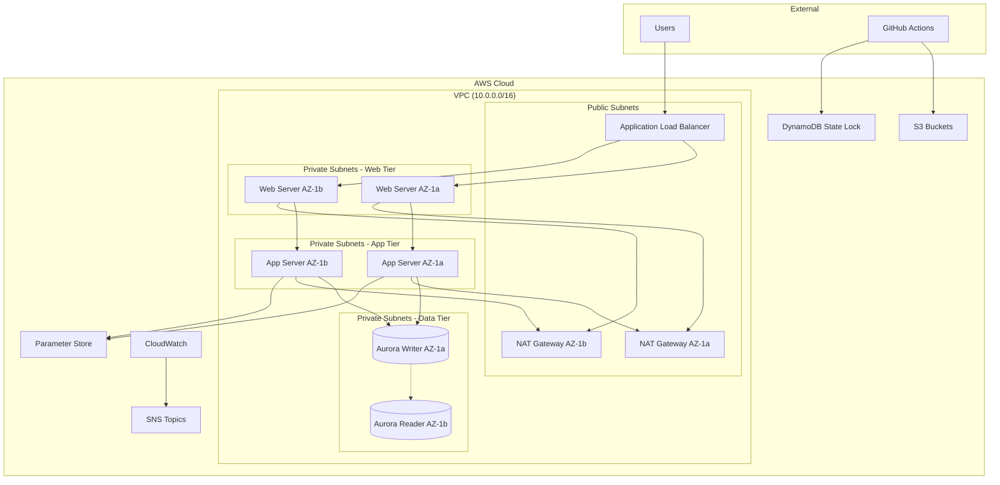

# Design Document

## Overview

The Automated Cloud Infrastructure project implements a production-ready, highly available AWS infrastructure using Infrastructure as Code (Terraform) with automated CI/CD pipelines. The system follows AWS Well-Architected Framework principles across security, reliability, performance efficiency, cost optimization, and operational excellence pillars.

The architecture deploys a three-tier web application infrastructure with automated deployment, comprehensive monitoring, and cost optimization features. The entire system is designed to be environment-agnostic and easily reproducible across different AWS accounts and regions.

## Architecture

### High-Level Architecture



### Network Architecture

- **VPC**: Single VPC (10.0.0.0/16) spanning multiple availability zones
- **Public Subnets**: 2 subnets (10.0.1.0/24, 10.0.2.0/24) for ALB and NAT Gateways
- **Private Subnets**: 6 subnets across 3 tiers and 2 AZs
  - Web Tier: 10.0.10.0/24, 10.0.11.0/24
  - App Tier: 10.0.20.0/24, 10.0.21.0/24
  - Data Tier: 10.0.30.0/24, 10.0.31.0/24
- **Internet Gateway**: Provides internet access to public subnets
- **NAT Gateways**: Enable outbound internet access for private subnets

### Compute Architecture

- **Auto Scaling Groups**: Separate ASGs for web and app tiers
- **Launch Templates**: Standardized EC2 configurations with user data scripts
- **Instance Types**: t3.micro for cost optimization (upgradeable via variables)
- **AMI**: Latest Amazon Linux 2023 with automatic updates enabled

### Database Architecture

- **Aurora Engine**: Aurora MySQL-compatible (latest stable version)
- **Instance Class**: db.t3.medium for all database instances (writer and readers)
- **Cluster Configuration**: 
  - **Writer Instance**: Single writer instance in primary AZ
  - **Reader Instances**: One reader instance in secondary AZ for high availability
  - **Auto Scaling**: Reader instances can auto-scale based on CPU/connection metrics
- **Storage**: 
  - **Type**: Aurora storage (automatically managed, distributed, and fault-tolerant)
  - **Size**: Starts at 10GB, auto-scales up to 128TB as needed
  - **Encryption**: Enabled at rest using AWS KMS default key
  - **Backup**: Continuous backup to S3 with point-in-time recovery
- **Backup Configuration**:
  - **Automated Backups**: 7-day retention period for development, 30 days for production
  - **Backup Window**: 03:00-04:00 UTC (low traffic period)
  - **Maintenance Window**: Sunday 04:00-05:00 UTC
  - **Snapshot Sharing**: Cross-region snapshot copying for disaster recovery
- **Security**:
  - **Subnet Group**: Deployed in private data tier subnets only
  - **Security Groups**: Restricted access from application tier only (port 3306)
  - **Parameter Store Integration**: Database credentials stored securely
  - **SSL/TLS**: Enforced connections with certificate validation
  - **IAM Database Authentication**: Optional for enhanced security
- **Monitoring**:
  - **Enhanced Monitoring**: Enabled with 60-second granularity
  - **Performance Insights**: Enabled for query performance analysis
  - **CloudWatch Logs**: Error logs, slow query logs, and general logs enabled
  - **Aurora Monitoring**: Built-in Aurora-specific metrics and dashboards
- **Performance**:
  - **Connection Pooling**: Configured at application level
  - **Read Scaling**: Automatic read replica scaling based on demand
  - **Aurora Serverless**: Optional for variable workloads (configurable)
  - **Global Database**: Optional for multi-region deployments

## Components and Interfaces

### Terraform Module Structure

```
terraform/
├── modules/
│   ├── networking/
│   │   ├── main.tf          # VPC, subnets, gateways
│   │   ├── variables.tf     # Network configuration variables
│   │   └── outputs.tf       # Network resource outputs
│   ├── security/
│   │   ├── main.tf          # Security groups, IAM roles
│   │   ├── variables.tf     # Security configuration variables
│   │   └── outputs.tf       # Security resource outputs
│   ├── compute/
│   │   ├── main.tf          # EC2, ASG, Launch Templates
│   │   ├── variables.tf     # Compute configuration variables
│   │   └── outputs.tf       # Compute resource outputs
│   ├── database/
│   │   ├── main.tf          # Aurora cluster and instances
│   │   ├── variables.tf     # Database configuration variables
│   │   └── outputs.tf       # Database connection outputs
│   ├── storage/
│   │   ├── main.tf          # S3 buckets and policies
│   │   ├── variables.tf     # Storage configuration variables
│   │   └── outputs.tf       # Storage resource outputs
│   └── monitoring/
│       ├── main.tf          # CloudWatch, SNS, alarms
│       ├── variables.tf     # Monitoring configuration variables
│       └── outputs.tf       # Monitoring resource outputs
├── environments/
│   ├── dev/
│   │   ├── main.tf          # Environment-specific configuration
│   │   ├── variables.tf     # Environment variables
│   │   └── terraform.tfvars # Environment values
│   └── prod/
│       ├── main.tf          # Production configuration
│       ├── variables.tf     # Production variables
│       └── terraform.tfvars # Production values
└── shared/
    ├── backend.tf           # Remote state configuration
    └── providers.tf         # AWS provider configuration
```

### Key Interfaces

#### Networking Module Interface
- **Inputs**: CIDR blocks, availability zones, environment tags
- **Outputs**: VPC ID, subnet IDs, security group IDs, NAT gateway IPs

#### Security Module Interface
- **Inputs**: VPC ID, allowed CIDR blocks, certificate ARNs, existing IAM role name
- **Outputs**: Security group IDs, existing IAM role reference

#### Compute Module Interface
- **Inputs**: Subnet IDs, security group IDs, AMI ID, instance types
- **Outputs**: Auto Scaling Group ARNs, Launch Template IDs, target group ARNs

#### Database Module Interface
- **Inputs**: Subnet IDs, security group IDs, database credentials, reader instance count
- **Outputs**: Aurora cluster endpoint, reader endpoint, connection string, backup configuration

## Data Models

### Terraform State Structure

```hcl
# Remote State Configuration
terraform {
  backend "s3" {
    bucket         = "terraform-state-${random_id.bucket_suffix.hex}"
    key            = "infrastructure/terraform.tfstate"
    region         = var.aws_region
    encrypt        = true
    dynamodb_table = "terraform-state-lock"
  }
}
```

### State Management Infrastructure

- **S3 Bucket**: Stores Terraform state files with versioning and encryption enabled
- **DynamoDB Table**: Provides state locking to prevent concurrent Terraform operations
  - **Table Name**: `terraform-state-lock`
  - **Primary Key**: `LockID` (String)
  - **Purpose**: Prevents state corruption from simultaneous deployments
  - **Billing Mode**: On-demand for cost optimization

### Environment Configuration Model

```hcl
# Environment-specific variables
variable "environment_config" {
  description = "Environment-specific configuration"
  type = object({
    name                = string
    instance_type       = string
    min_capacity        = number
    max_capacity        = number
    desired_capacity    = number
    db_instance_class   = string
    backup_retention    = number
    monitoring_enabled  = bool
    cost_alerts_enabled = bool
  })
}
```

### Security Configuration Model

```hcl
# Security group rules configuration
variable "security_rules" {
  description = "Security group rules configuration"
  type = map(object({
    type        = string
    from_port   = number
    to_port     = number
    protocol    = string
    cidr_blocks = list(string)
    description = string
  }))
}

# IAM configuration for lab environment
variable "iam_config" {
  description = "IAM configuration using existing lab role"
  type = object({
    lab_role_name = string
    use_existing_role = bool
  })
  
  default = {
    lab_role_name = "labrole"
    use_existing_role = true
  }
}
```

### Database Configuration Model

```hcl
# Aurora database configuration variables
variable "aurora_config" {
  description = "Aurora MySQL database configuration"
  type = object({
    engine                = string
    engine_version        = string
    instance_class        = string
    storage_encrypted     = bool
    backup_retention_period = number
    backup_window         = string
    maintenance_window    = string
    monitoring_interval   = number
    performance_insights_enabled = bool
    deletion_protection   = bool
    skip_final_snapshot   = bool
    copy_tags_to_snapshot = bool
    reader_count          = number
    auto_scaling_enabled  = bool
    auto_scaling_min_capacity = number
    auto_scaling_max_capacity = number
    serverless_enabled    = bool
    global_cluster_enabled = bool
  })
  
  default = {
    engine                = "aurora-mysql"
    engine_version        = "8.0.mysql_aurora.3.04.0"
    instance_class        = "db.t3.medium"
    storage_encrypted     = true
    backup_retention_period = 7
    backup_window         = "03:00-04:00"
    maintenance_window    = "sun:04:00-sun:05:00"
    monitoring_interval   = 60
    performance_insights_enabled = true
    deletion_protection   = false
    skip_final_snapshot   = false
    copy_tags_to_snapshot = true
    reader_count          = 1
    auto_scaling_enabled  = true
    auto_scaling_min_capacity = 1
    auto_scaling_max_capacity = 3
    serverless_enabled    = false
    global_cluster_enabled = false
  }
}
```

## Error Handling

### Terraform Error Handling

1. **State Management Errors**
   - Implement state locking with DynamoDB
   - Use remote state with versioning enabled
   - Implement state backup and recovery procedures

2. **Resource Creation Failures**
   - Use depends_on for explicit resource dependencies
   - Implement retry logic in user data scripts
   - Use lifecycle rules to prevent accidental resource deletion

3. **Validation Errors**
   - Implement variable validation rules
   - Use terraform validate in CI/CD pipeline
   - Implement pre-commit hooks for syntax checking

### CI/CD Error Handling

1. **Pipeline Failures**
   - Implement proper exit codes and error propagation
   - Use GitHub Actions matrix strategy for parallel validation
   - Implement rollback mechanisms for failed deployments

2. **Authentication Errors**
   - Use OIDC with proper role assumptions
   - Implement credential rotation and expiry handling
   - Use least privilege access principles

3. **Cost Threshold Breaches**
   - Implement Infracost checks with failure thresholds
   - Use AWS Budget alerts for cost monitoring
   - Implement automatic resource cleanup for dev environments

## Testing Strategy

### Infrastructure Testing

1. **Static Analysis**
   - Terraform validate for syntax checking
   - tflint for best practices validation
   - Checkov for security and compliance scanning
   - terraform fmt for code formatting consistency

2. **Plan Validation**
   - Automated terraform plan in CI/CD
   - Plan output analysis for unexpected changes
   - Cost impact analysis with Infracost
   - Security impact analysis with tfsec

3. **Integration Testing**
   - Terratest for infrastructure integration testing
   - AWS Config rules for compliance validation
   - Health check endpoints for application validation
   - Load testing for performance validation

### CI/CD Testing

1. **Workflow Testing**
   - GitHub Actions workflow validation
   - OIDC authentication testing
   - Branch protection rule validation
   - Notification system testing

2. **Security Testing**
   - IAM policy validation
   - Security group rule testing
   - Encryption validation
   - Access control testing

3. **Monitoring Testing**
   - CloudWatch alarm testing
   - SNS notification testing
   - Dashboard functionality validation
   - Log aggregation testing

### Disaster Recovery Testing

1. **Backup and Restore**
   - RDS backup and restore procedures
   - Infrastructure recreation from Terraform state
   - Cross-region disaster recovery testing
   - Data integrity validation

2. **Failover Testing**
   - Multi-AZ failover simulation
   - Auto Scaling Group health check validation
   - Load balancer failover testing
   - Application resilience testing

### Performance Testing

1. **Load Testing**
   - Application Load Balancer performance testing
   - Auto Scaling trigger validation
   - Database performance under load
   - Network throughput testing

2. **Scalability Testing**
   - Horizontal scaling validation
   - Resource limit testing
   - Cost optimization under scale
   - Performance monitoring validation